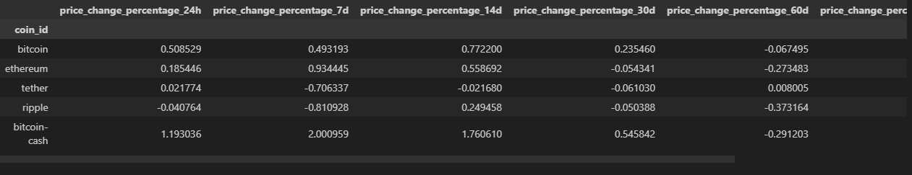
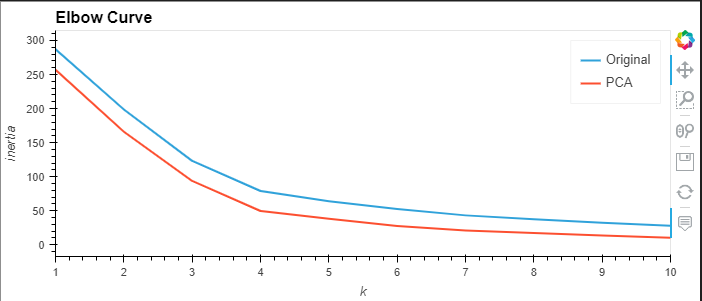
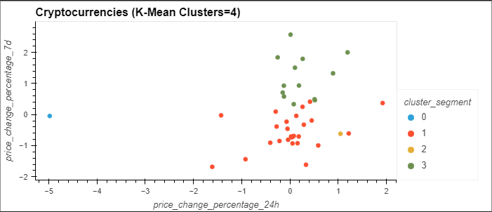
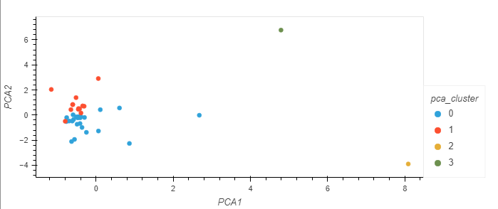

## Machine Learning (Unsupervised)
## Crypto Market Data Analysis
---
### Machine Learning

Machine learning is the practice of applying computer algorithms and statistics to create models that can learn from past data and then make decisions or predictions about future data. Algorithms learn how to make decisions without needing anyone to program the logic directly. They learn the patterns, behavior, and relationships on their own directly from the data, and then they use that knowledge to make decisions and predictions.

Some Examples:
- Image recognition
- Social media personalization
- Tv, movie, and video recommendations
- Healthcare personalization.

### Unsupervised Learning

In Unsupervise machine learning, the algorithm tries to make sense of an unlabled dataset by extracting features and patterns on its own. For example, when you're reviewing a particular item for purchase on a website, unsupervised learning algorithms might be used to identify related items that are frequently bought together. Unsupervised learning can be used to identify clusters, or related groups, of clients to target with product offerings or marketing campaigns.

### Goal

In this Unsupervised Machine learning by using Python knowledge we have to predict if cryptocurrencies are affected by 24-hour or 7-day price changes.

### Methodology

- First we scale the dataset with StadardScaler module from SciKit-Learn.
- Second step involves using the elbow method to identify the best value for k. The K-means algorithm is useful for grouping and understanding data.
- Third step, we can enhance and optimize machine learning algorithms by applying Principal Component Analysis, or PCA. PCA reduces the number of factors by transforming a large set of features into a smaller one that contains MOST of the information of the original larget dataset.

### Results 

DataFrame with Scaled Data

Composite plot to contrast the Elbow curves

Composite plot to contrast the clusters

### Conclusion
Based on the Elbow curve and PCA, k=4 is the correct one. In the scatter plot the original data are spread out. After applying PCA we can visualize that clusters are more concentrated.

